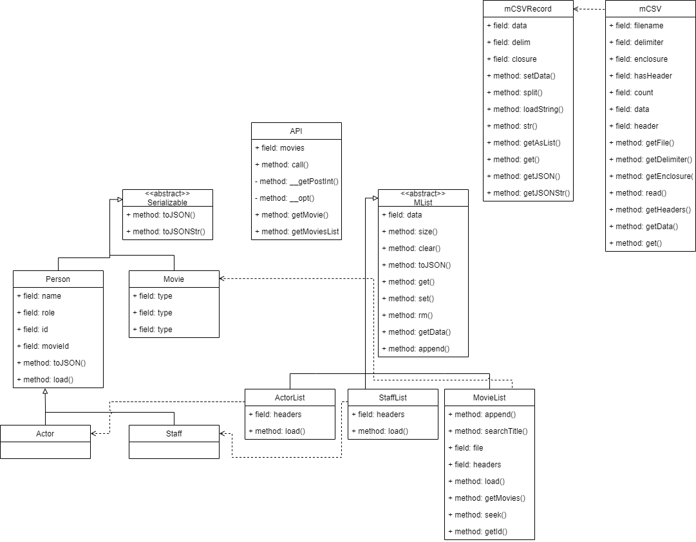

# Catalyst-Movie-Database

## Prerequisites

Python version 3.6 and newer is recommended 

```bash
sudo apt install python3.9
```

Use the package manager [pip](https://pip.pypa.io/en/stable/installation/) to install Flask.


```bash
sudo apt install python3-pip
```

Install Flask

```bash
pip install Flask
```
## Usage

Clone/Download the Repo
```bash
git clone https://github.com/nityagandu/Catalyst-Movie-Database.git
```

Run main from the downloaded code

```bash
python3 main.py
```

Then go to the localhost which is located at http://localhost:5000/

You should be free to use the website.


## High Level Concept

uml diagram of the project


Once the application starts main calls init which loads the csv files concurrently to be read by the csv readers and parsed into lists of the respective objects (Movies and Person) These lists are arrays of all the movies in the form of Movie classes and lists of the staff and actors.

All calls from the browser are handled by main.py which loads the relevant searches and analytics.

## Testing

Install Pytest
```bash 
pip install pytest
```

To run the tests
```bash
python -m pytest
```

The Test Files are located under [Test Location](tests/)
